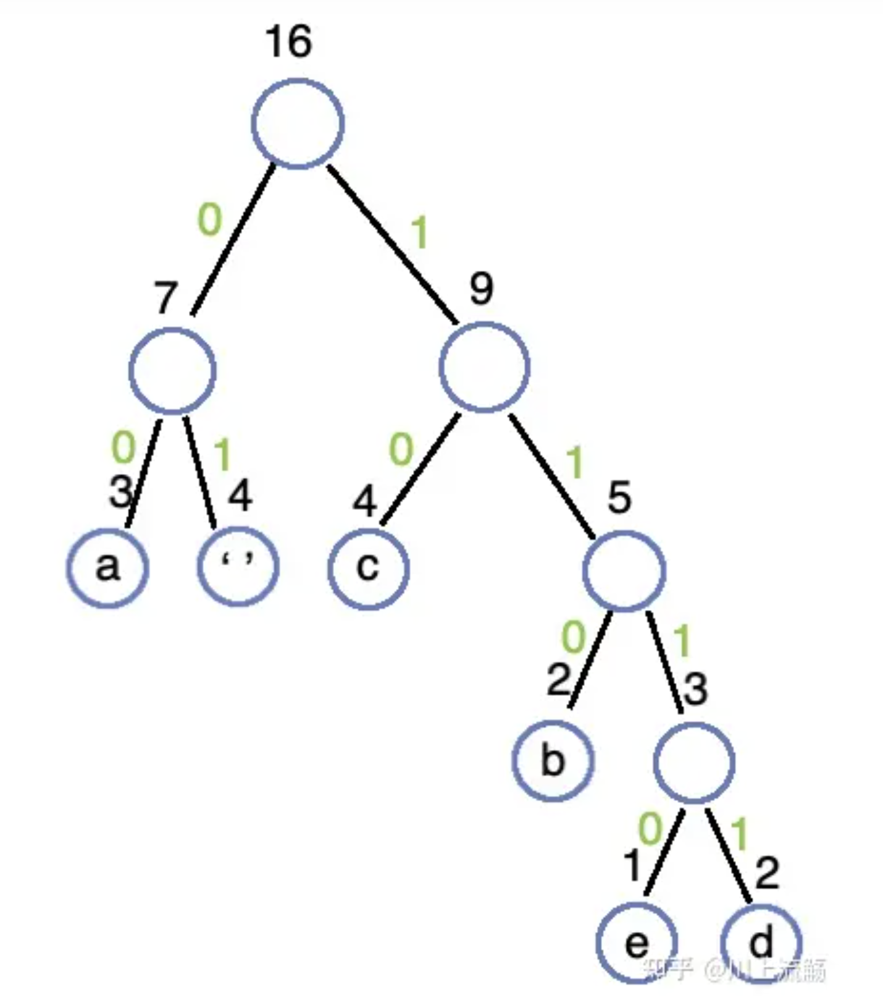
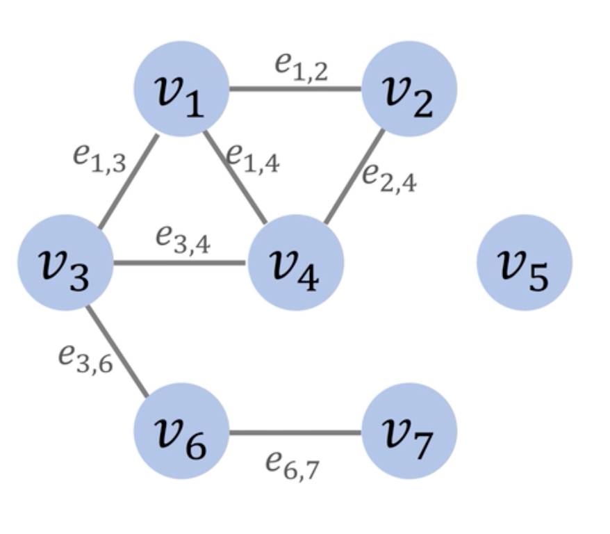
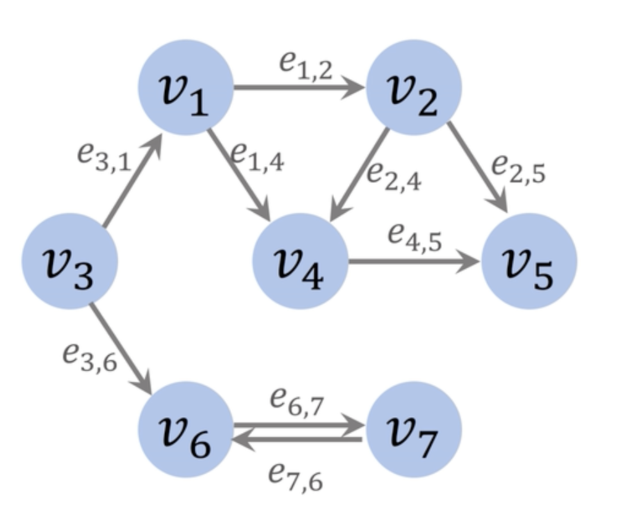
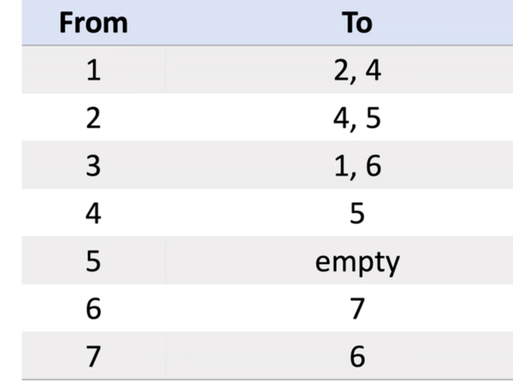
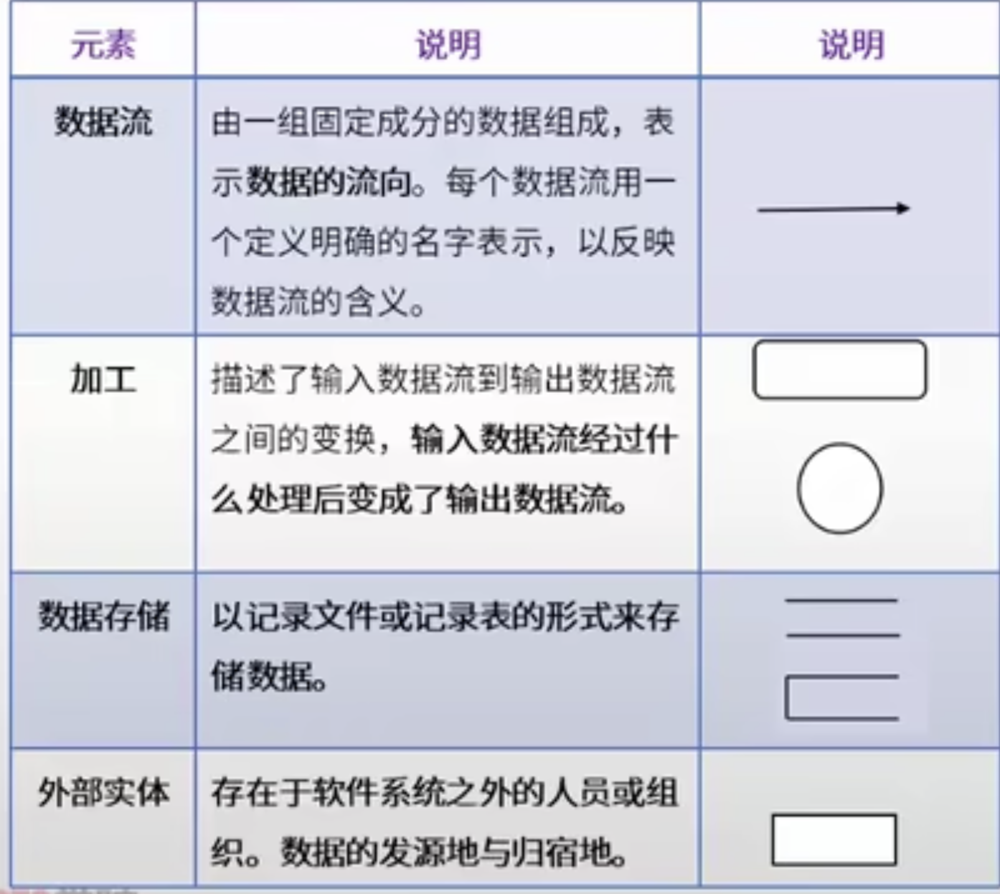

{
    "author": {
        "name": "王进康",
        "url": "https://ics.nju.edu.cn/~jyy/"
    },
    "departments": [
        {
            "name": "  河南大学  ",
            "url": "https://www.nju.edu.cn/main.htm",
            "img_url": "./img/henu.jpeg"
        },
        {
            "name": "  淳阳项目组  ",
            "url": "https://cs.nju.edu.cn/main.htm",
            "img_url": "./img/puresun.png"
        },
        {
            "name": "   软件组  ",
            "url": "https://www.nju.edu.cn/main.htm",
            "img_url": "./img/softwarelogo.jpeg"
        }
    ]
}
+++++

# 软件设计师

----
## 数据结构
正规式就是我们平常说的正则表达式

1.  哈夫曼树的结点数和构造以及编码
2.  逆波兰表达式
3.  有向图和无向图
4.  关键路径与松弛时间
5.  折半查找
6.  拓扑排序
7.  广度优先遍历，深度优先遍历
8.  快速排序
9.  有向图的邻接矩阵，邻接链表
10. 二叉排序树

----
## 哈夫曼树的结点树的构造以及编码
假设有n个权值,则构造出的哈夫曼树就有n个叶子节点

1. 构造规则
    + 将所有的结点都放到一起,根据权值由小到大排序
    + 从节点列表中找出两个权值最小的进行合并形成一个根节点，根节点的权值为两个权值的和,并且这两个节点较小的在左边，较大的在右边
    + 从列表中删除刚才选的那两个节点，并且把合并后的节点放入，并再次排序
    + 一直重复上述过程

----
2. 节点个数
    + 因为在二叉树中度为2的节点个数比度为0的节点个数少一,并且n个权值就有n个度为0度节点,那所有的节点数就为2n-1.
3. 前缀编码
    + 将构造好的哈夫曼树丛根节点开始,左边的边赋值为0,右边的边赋值为1.
    + 从上往下组成二进制代码

----
## 逆波兰表达式

 + *(1+2)x(3+5)将运算符放到中间这叫中缀表达式*
 + *而逆波兰表达式就是将运算符放到最后*
    + *如12+35+x*

----
## 图
1. 无向图
    + 对于图来说,可以用邻接矩阵和邻接表
    + 对于一个有n个顶点的图,邻接矩阵的大小为n x n
    + 有边的为权重值,无边的为0或者为无穷(∞)

----
2. 有向图

----
## 关键路径
1. *关键路径:从开始到结束得所有路径中，所需要时间最长的一条为关键路径。*

+ 从开始到结束,这里的每一个点都需要完成
+ 不是说只有关键路径的点才需要完成
+ 只是关键路径需要的时间最多,
+ 其他路径完成了也得等着关键路径完成。

1. *关键路径可以能不止一条,可以有多条路径的时间是一样的*
2. *我们重点关注一下松弛时间*

----
## 松弛时间
1. *松弛时间:不影响完工前提下,任务可以被推迟完成的最大时间*
2. *活动最晚开始时间-最早开始时间*
3. *关键路径的总时间-包含该任务的关键路径花的时间*
4. *以活动FG为例*

+ 最早开始时间=A->D->F,为10+8=18
+ 最晚开始时间:*因为关键路径是耗时最长的,所以对于某个活动,他可以等到关键路径的时间-该活动到终点的时间*
    + 关键路径时间:48,FG到达终点时间:7+3=10,最晚开始时间:48-10=38
+ 松弛时间:38-10=20

---
## 操作系统
1.  进程资源图
2.  PV操作信号量
3.  页表的计算

----
## 进程资源图

1. *P：进程,R：一类资源,R中的圆圈数：该类资源有几个*
2. *读图时，先看资源分配R→P，再看资源申请P→R*
3. *如果所有节点都是阻塞的——此进程资源图不可以化简，是死锁的*
4. *如果有节点不是阻塞的——*
    + 将非阻塞节点周围的箭头删去，只保留阻塞节点的箭头
    + 此时，观察现在得到的图中，原来的阻塞节点是否阻塞？
    + 如果在新图中，它是非阻塞的，则原图是可以化简的，非死锁的
5. *同时有多个进程申请同一资源,但是只是提出了申请,并不意味着资源申请已被响应*
6. *注意区分死锁和阻塞*

----
## 进程资源图的化简
1. *化简是动态的,从未阻塞的进程出发并且化简的时候就默认这个未阻塞的进程已经执行完了*
    + *就要释放分配给他的资源和他使用的资源,然后资源数就会变化,然后再重新分配就好*

----

## PV操作
1. PV操作的意义:实现线程之间的并发和互斥
2. 生产者和消费者等模型:本质上对多个进程之间关系的抽象
3. 没有PV操作会怎样:
4. PV操作的P和V的意思:
    + P(Proberen):等待或申请操作。它用于表示进程试图进入临界区（或申请共享资源）
    + V(Verhogen):释放操作。它用于表示进程已经完成对临界区（或共享资源）的访问
5. 并发的本质还是将可并发的部分并发执行,不可并发的部分依旧串型执行
---
## 计算机组成原理
1.  cpu流水线执行指令
2.  有限自动机————字符串识别
3.  有向图和无向图
4.  有限自动机与正则表达式
5.  RAM组成内存需要的片数

----
## cpu流水线执行指令
1. *流水线技术就是并发,由于执行指令的有些阶段用到的资源不同*
2. *在同一时钟周期或者某个周期可以指令多个指令的某个阶段*

+ 我们可以看到当第一条指令被执行完后,
+ 后面每过一个时钟周期都会执行完一条指令

两种情况:

1. 如果流水线中的各段执行时间均为t，那么执行n条指令的时间就是执行第一条指令的时间kt，加上其余n-1条指令各执行一段的时间(n-1)t。
2. 如果流水线中的各段执行时间不等，且最长段的执行时间为tmax,那么执行n条指令的时间就是执行第一条指令的时间T，加上其余n-1条指令各执行最长段的时间(n-1)tmax
​
---
## 计算机网络
1.  url格式问题
2.  逆波兰表达式
3.  有向图和无向图

--- 
## 设计模式
1. 各个设计模式分属的类型

--- 
## 知识产权

---
## 数据库

1. 关系

---
## 软件工程
1. 数据流图
2. UML图

----
## 数据流图

1. 一个顶层数据流图和一个0层数据流图
    + 顶层:展示系统整体的一个功能情况
    + 0层:具体展开每一个功能的实现情况
2. 注意外部实体的抽离
3. 分析出系统内的实体的系统外的实体

---
## 硬件

1. 数字信号的判断

----
## 最长公共子序列
