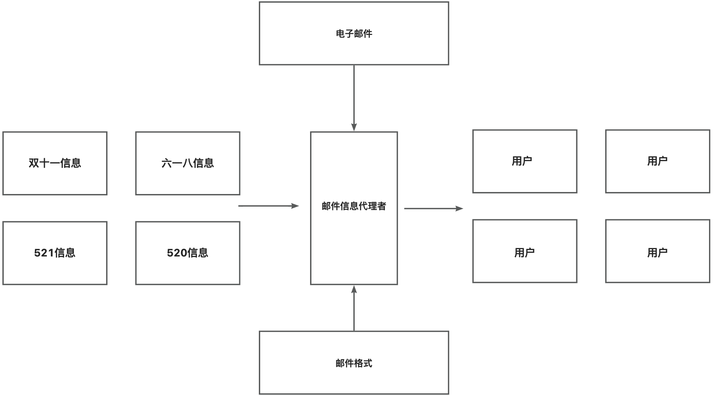
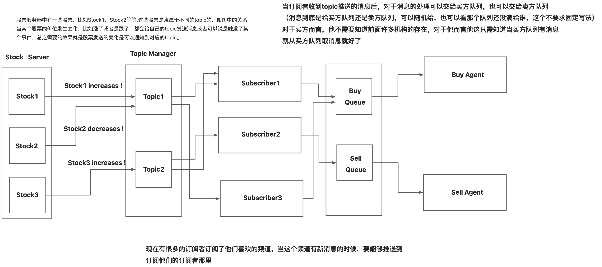
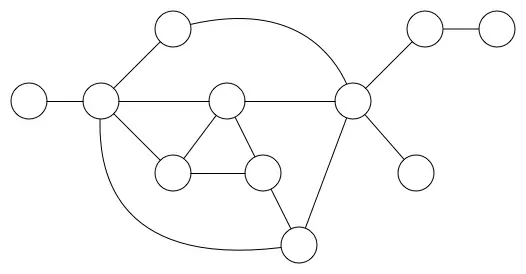
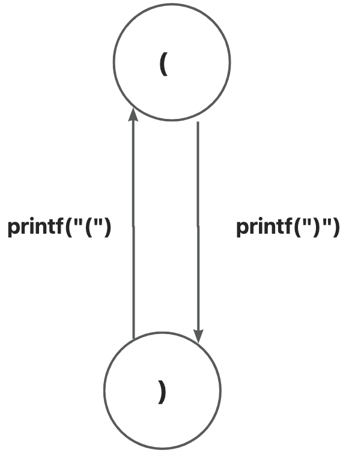
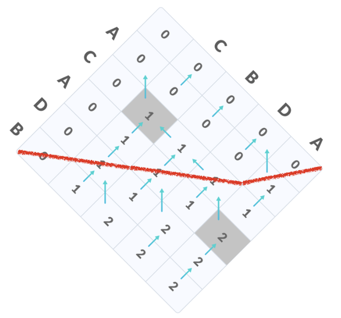

{
"author": {
"name": "王进康",
"url": "https://ics.nju.edu.cn/~jyy/"
},
"departments": [
{
"name": " 河南大学 ",
"url": "https://www.nju.edu.cn/main.htm",
"img_url": "./img/henu.jpeg"
},
{
"name": " 淳阳项目组 ",
"url": "https://cs.nju.edu.cn/main.htm",
"img_url": "./img/puresun.png"
},
{
"name": " 软件组 ",
"url": "https://www.nju.edu.cn/main.htm",
"img_url": "./img/softwarelogo.jpeg"
}
]
}
+++++

# 软件组2022级考核

----

## 考核内容

**_设计模式_**

+ 双十一（easy） 
+ 股票（_hard_）
+ 实际开发中真实的设计模式的应用
+ "忘掉"设计模式
 
 

**_数据结构_**

  + 树 &nbsp;&nbsp;&nbsp;&nbsp;&nbsp;&nbsp;&nbsp;&nbsp; the logical structure of sensor
  + 栈,队列&nbsp;&nbsp;describe the logical structure of the data ?
  + 图 &nbsp;&nbsp;&nbsp;&nbsp;&nbsp;&nbsp;&nbsp;&nbsp; Topology of data
  + 程序 = 数据结构 + 算法 ?

----

## 考核内容

**_并发导论_** 

+ 左括号,右括号(消费者-生产者) 
+ 嵌套的左括号,右括号 
+ 打印鱼？(好玩的东西) 
+ (why)为什么要并发 
+ (how)如何划分并发任务
 
 

**_底层原理_**

  + 世界线收束

---

# 设计模式

# Design Patterns

----

## 双十一

**_题目描述_**
 

&nbsp;&nbsp;&nbsp;&nbsp;&nbsp;&nbsp;&nbsp;&nbsp; 马上双十一，需要给多个顾客发电子邮件，电子邮件的信息的内容跟平常不同，是跟双十一有关的内容，但是后面还有其他的购物节，到那时候电子邮件的信息又不一样，而且要求到平常的时候，电子邮件的信息又要回到原来平常的信息.

 
 

**_思考_**

1. How to abstract into a logical structure?
2. How to use design pattern? one,two,three.....
3. How to deal with it without the design pattern?

----
## 一个可能的设计
1. 每个不同的节日都有对应的内容,将不同的内容抽出来
2. 每个节日都需要将对应的内容装配到邮件中
3. 最后新增节日时，只需要新增节日对应的内容
4. 不想重写发送邮件的接口
5. 好像可以让一个类代理？
 

----
## 股票
<del>好像没有题目描述,只有图示,貌似是我的锅</del>

 
 

 

----
## 实际开发中真实的设计模式的应用

<del>其实,你们已经见到过了</del>

1. SpringBoot的源码
    + 各种特性几乎是各种设计模式的叠加
2. Mybatis or Mybatis-plus的源码
3. Hutool包
4. 几乎你们在Java开发中常用的包中多多少少都有设计模式的影子

 
 

***这么说多多少少还是有点抽象,以实际 IoT 开发的一个小场景为例***

 

<del>其实只是我被重构多次折磨后不得不做罢了</del>

----
## 实际案例

1. 想象一下我们生产的传感器在全国畅销如潮,近如郑州,远至上海.
2. 但是硬件现在需要升级功能,如果在设计时,只考虑垂直设计,一层一层地叠,
3. 最后升级的话,甚至还需要将硬件回收,再集中升级?
4. 显然,这不是一个好主意,我们似乎自然而然地想到了解决对象——抽象
5. 如果我们在设计硬件的时候,考虑到将来功能必然要升级,我们似乎可以将硬件所执行的逻辑抽象
6. 比如 match-action——当match匹配到某一个值,执行相应的action。
7. 如果我们还能有一个软件系统能动态更新这个 match-action表,似乎硬件可以自动更新,或者换个词(自学习?自适应?)
8. 好像是可行的,尝试画个图玩玩

----
# "忘掉"设计模式

----

## "忘掉"设计模式

*学设计模式有一段时间,似乎有种学了但没咋学的感觉* -- <del>我*，如学</del>

<del>这是个挺尴尬的事情,好像仅仅只是将设计模式当作一门课水过去,看那些源码还是困难,或者当数量如SpringBoot源码动则十几个更甚如设计模式套设计模式,还是无法理解</del>

我们写程序,总是说要有个场景,有个场景,其实回顾一下,似乎可以总结为,将物理世界的问题投影到数字世界中
咦,我们试着从这个角度回顾一下,似乎真的是这样

1. 将问题抽象为对象,
2. 从物理问题中抽象出简单的逻辑关系
3. 最后将逻辑关系映射到对象上
4. 之后模拟这个物理问题的好像只是这个逻辑关系
5. 即使之后要修改,似乎只是增添了几个对象,逻辑关系似乎还没变?
6. 似乎对于设计模式知道了什么......

***似乎好像这个观念对于计算机体系来说都可以这样认为,下面的设计模式好像就可以这么用***

---
# 数据结构
# Data Structure

----
## 树

***这里我们暂时不去想设计模式那样,深究数据结构相较于计算机的意义,并且这个也不是我们这次考核的重点***

<del>其实是我搞不完了,设计模式的内容还是我半夜赶的稿</del>

1. 任务是要用任何一种熟悉的编程语言
2. 通过抽象的逻辑关系,在控制台中打印
3. 可以通过迭代，也可以通过递归,whatever you want 
4. 确保即插即用?
5. 其实树能扯的东西特别多,用处也特别多,
6. 但碍于时间限制,以及这次考核的限制....
6. 或许下次考核的重点就是数据结构

<del>这样我就有时间去深入挖掘,好像是在为我的懒惰找借口</del>

----
## 树

 

----
## 栈,队列

先看两个小小的算法

1. 深度优先搜索
2. 广度优先搜索

<del>栈和队列与这两个算法有什么关系?</del>

<del>貌似这里我如果实现一个可以在线画图的库,就可以直接画出深度优先搜索的算法,计划表上有多了一项不知道什么时候才能完成的任务</del>

----

## 深度优先搜索

 

+ 深度优先,顾名思义先沿一条路走到黑,走完再回来走另一条路,
 <del>如果走不完那就不回来</del>

1. 那右侧节点的顺序就可以是
    + 1
    + 2->5->9
    + 3->6->10,
    + 7,
    + 4->8

----
## 深度优先搜索

3. 那这跟队列和栈有什么关系？
4. 如果不用递归或者说,用迭代来模拟递归 -> 2,3,4同时被挑出来,却将2的整个一支执行后才轮到3,4
5. 这似乎有点关系,如果将2的孩子跟3,4做比较
6. 3,4是先被选,2的孩子是后选,先选后执行,后选先执行......

 

----
## 广度优先搜索

1. 与其是一个顺序关系,不如说是一个制约关系,后面的子孩子执行完才能执行前面的兄弟节点
2. 好像需要设置一个能实现先来后处理,后来先处理的容器.....
3. 有了深度的例子,广度似乎好像也是这样
  + 1->2->3->4->5->6->7->8->9->10
4. 有点像层次遍历?
5. 对比于深度,似乎是按层级顺序或者是先后顺序?先选的先执行

 

----
## 优先搜索

1. 我们好像什么也没说,但是什么都说了
2. 我们是似乎可以用一个无环状态图来表示执行顺序
3. 偶然间发现其实这些数据结构做的好像就是一件事 --> 描述任务的执行顺序
4. 可能任务有点具体了，如果我们将这些执行顺序写成一个三元组,四元组
5. (10,A,G)->(9,B,E),并且我们给其用一个更加逻辑化的词语---状态
6. 状态的改变,状态的转移,状态的传播,状态的依赖
7. 程序是一个状态机......
8. 好像发现了什么不得了的东西

----
## 图

刚才,似乎有一个程序是状态机的一个概念,

那这跟图又有什么关系?

如果我们将图的概念简化一点,将图认为是有一个个点节点和边连接的一个结构

好像我们前面树的图也是这么画的,好像链表也可以这么画,似乎队列和栈也可以

似乎这些数据结构都在处理一件事情,程序是一个状态机?

如果我们将节点当作是一个状态,一条边当作是一个能引起状态变化的操作

嗯? &nbsp;好像又想起了一句话:程序 = 数据结构 + 算法

如果将数据结构描述为状态的集合,算法当作边的处理,似乎这两句话是一个意思!!!

----
## 图

意识到上面一点后,图这里能说的好像更多了,但这次图这里我们就先到这里

这次考核主要的目的还是理解 "数据结构"

<del>其实就是我没时间了,现在都已经是半夜了,挖的坑太多.....</del>

---
# 并发导论

----
## 左括号,右括号

+ 在数据结构那里，我们得到了一个结论---程序就是一个状态机
+ 同时,我们也又似乎知道数据结构是用来描述状态或者是状态转移的
+ 这跟并发又有什么关系?
+ 我们不妨先将打印左括号和右括号这个程序用图的方式表示

----
## 左括号,右括号

+ 我们是要先打左括号,再打右括号,打完一个右括号,就又能打一个左括号......
+ 好像是打印一个左括号就能打印一个右括号,打印一个右括号就能打印一个左括号
+ 这好像也是一种顺序,我们似乎可以将这种顺序抽象成先进先出或者先进后出?
+ 似乎是可以用栈和队列实现?
+ 但我们又想如果我的电脑能同时处理打印左括号,打印右括号两个任务,似乎没啥用
+ 还是要遵守顺序,不遵守顺序可能会打印错误的形状

----
## 左括号,右括号

+ 那还要并发干什么?
+ 如果我们将打印左括号这个任务换成处理一个一百万乘一百万的矩阵
+ 我们经过计算,发现矩阵中某些数据之间没有状态转换
+ 换言之,那些数据不受其他数据的制约，也就是说当一个cpu处理其他数据,这些数据也能被处理
+ 似乎并发有了一些意义

----

## 左括号,右括号

+ 我们还可以更近一步,将并发描述成
  + 在原来的状态转移中,找出在某个时刻不受其他状态影响的状态,同时处理这些状态转移

----
## 嵌套的左括号,右括号

<del>待填</del>

----
## 打印鱼

<del>待填</del>

----
## 为什么要并发

<del>待填</del>

----
## 如何划分并发任务

<del>待填</del>

---
# 底层原理

----
## 世界线收束
<del>待填</del>